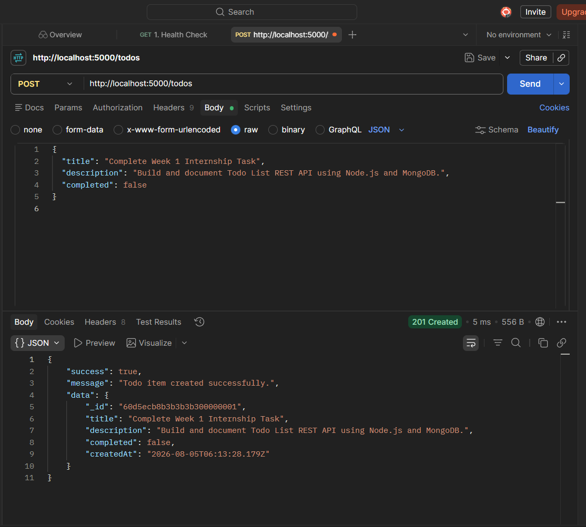
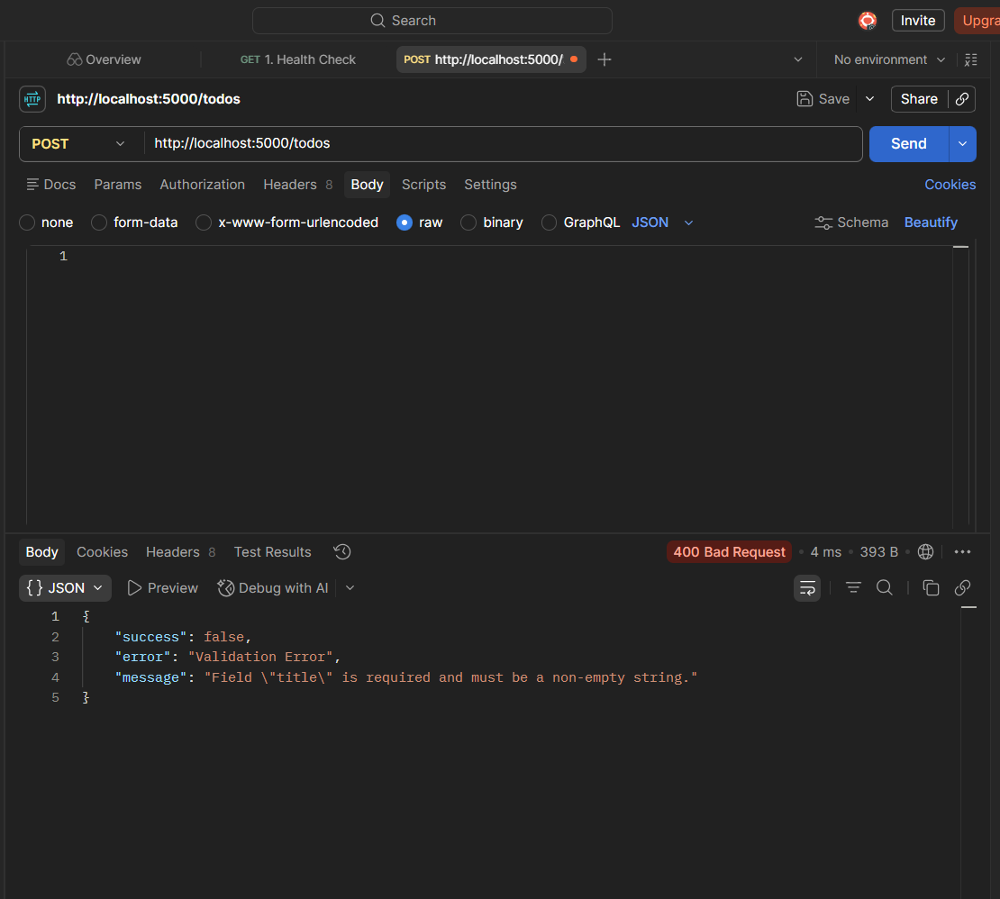

# Todo List REST API

> **Track**: Backend Web Development | **Week 1 Task**  
> **Program**: Live Pakistan Internship Program  
> **Repository**: [hasanimr1/Live-Pakistan-Task-1](https://github.com/hasanimr1/Live-Pakistan-Task-1)

A RESTful API for a Todo List application built with Node.js, Express.js, and MongoDB (Mongoose). Supports full CRUD operations with input validation and centralized error handling.

---

## Features

- Full CRUD support across five endpoints (`GET`, `POST`, `PUT`, `DELETE`)
- Mongoose schema-level validation for all fields
- Centralized error middleware handling invalid IDs (400), missing resources (404), and server errors (500)
- Modular `.env` configuration
- Pre-configured Postman collection for immediate endpoint testing

---

## Tech Stack

| Layer | Technology |
|---|---|
| Runtime | [Node.js](https://nodejs.org/) |
| Framework | [Express.js](https://expressjs.com/) |
| Database | [MongoDB](https://www.mongodb.com/) via Mongoose ODM |
| Environment | [dotenv](https://github.com/motdotla/dotenv) |
| CORS | [cors](https://github.com/expressjs/cors) |

---

## Project Structure

```
Tasks/
├── Screenshots/                  # Postman test demonstration screenshots
│   ├── Create_todo.PNG
│   ├── Deleting Todo.PNG
│   ├── Fetching By ID.PNG
│   ├── Fetching data.PNG
│   ├── Input_validation.PNG
│   ├── Updateing Todo List.PNG
│   └── Validating Delete Request.PNG
├── src/
│   ├── config/
│   │   └── db.js                 # MongoDB connection
│   ├── controllers/
│   │   └── todoController.js     # Request handler logic
│   ├── middleware/
│   │   ├── errorHandler.js       # Centralized error handler
│   │   └── validateTodo.js       # Request payload validation
│   ├── models/
│   │   └── Todo.js               # Mongoose schema
│   ├── routes/
│   │   └── todoRoutes.js         # API router
│   └── app.js                    # Express application setup
├── .env                          # Local environment variables (not committed)
├── .env.example                  # Environment variable template
├── package.json
├── server.js                     # Application entry point
└── Todo_List_REST_API.postman_collection.json
```

---

## Prerequisites

- Node.js v14 or higher
- MongoDB running locally, or a MongoDB Atlas connection URI

---

## Setup & Installation

**1. Install dependencies**
```bash
npm install
```

**2. Configure environment variables**

Copy `.env.example` to `.env` and fill in the values:
```env
PORT=5000
MONGODB_URI=mongodb+srv://<username>:<password>@cluster0.xxxxx.mongodb.net/todo_db?retryWrites=true&w=majority
NODE_ENV=development
```

**3. Start the server**

Development mode (auto-reload via nodemon):
```bash
npm run dev
```

Production mode:
```bash
npm start
```

The server will be available at `http://localhost:5000`.

---

## API Reference

### Health Check

| Method | Endpoint | Description |
|--------|----------|-------------|
| GET | `/` | Returns API status and available endpoints |

**Response `200 OK`**
```json
{
  "success": true,
  "message": "Welcome to Todo List REST API (Live Pakistan Internship - Week 1)",
  "version": "1.0.0"
}
```

---

### Todo Endpoints

| Method | Endpoint | Description |
|--------|----------|-------------|
| GET | `/todos` | Retrieve all todo items |
| GET | `/todos/:id` | Retrieve a single todo by ID |
| POST | `/todos` | Create a new todo item |
| PUT | `/todos/:id` | Update an existing todo item |
| DELETE | `/todos/:id` | Delete a todo item |

---

### GET /todos

Returns all todos sorted by creation date (newest first).

**Response `200 OK`**
```json
{
  "success": true,
  "count": 1,
  "data": [
    {
      "_id": "66b08e2f1a2b3c4d5e6f7a8b",
      "title": "Complete Backend Internship Task",
      "description": "Build Todo List REST API using Node.js and MongoDB",
      "completed": false,
      "createdAt": "2026-08-05T10:45:00.000Z"
    }
  ]
}
```

---

### GET /todos/:id

**Response `200 OK`**
```json
{
  "success": true,
  "data": {
    "_id": "66b08e2f1a2b3c4d5e6f7a8b",
    "title": "Complete Backend Internship Task",
    "description": "Build Todo List REST API using Node.js and MongoDB",
    "completed": false,
    "createdAt": "2026-08-05T10:45:00.000Z"
  }
}
```

**Error Responses**: `400 Bad Request` (invalid ObjectId format), `404 Not Found`

---

### POST /todos

**Request Body**
```json
{
  "title": "Submit Week 1 Task",
  "description": "Export Postman collection and upload repository link",
  "completed": false
}
```

- `title` (string, required): Must be a non-empty string.
- `description` (string, optional): Defaults to an empty string.
- `completed` (boolean, optional): Defaults to `false`.

**Response `201 Created`**
```json
{
  "success": true,
  "message": "Todo item created successfully.",
  "data": {
    "_id": "66b08e301a2b3c4d5e6f7a8c",
    "title": "Submit Week 1 Task",
    "description": "Export Postman collection and upload repository link",
    "completed": false,
    "createdAt": "2026-08-05T10:46:00.000Z"
  }
}
```

---

### PUT /todos/:id

Accepts a partial or full update. At least one field must be provided.

**Request Body**
```json
{
  "completed": true
}
```

**Response `200 OK`**
```json
{
  "success": true,
  "message": "Todo item updated successfully.",
  "data": {
    "_id": "66b08e301a2b3c4d5e6f7a8c",
    "title": "Submit Week 1 Task",
    "description": "Export Postman collection and upload repository link",
    "completed": true,
    "createdAt": "2026-08-05T10:46:00.000Z"
  }
}
```

**Error Responses**: `400 Bad Request`, `404 Not Found`

---

### DELETE /todos/:id

**Response `200 OK`**
```json
{
  "success": true,
  "message": "Todo item with ID '66b08e301a2b3c4d5e6f7a8c' deleted successfully.",
  "data": {
    "id": "66b08e301a2b3c4d5e6f7a8c"
  }
}
```

**Error Responses**: `404 Not Found`

---

## 📷 Postman Testing Screenshots

Visual demonstration of API tests executed via Postman:

| Test Action | Screenshot Preview |
|---|---|
| **Create Todo** |  |
| **Fetch All Todos** |  |
| **Fetch Todo By ID** |  |
| **Update Todo Item** |  |
| **Delete Todo Item** |  |
| **Input Payload Validation** |  |
| **Validate Delete Request** |  |

---

## Postman Collection

1. Open Postman and click **Import**.
2. Select `Todo_List_REST_API.postman_collection.json` from the project root.
3. Ensure the server is running on `http://localhost:5000`.
4. Run the pre-configured requests to test all endpoints.

---

## Submission Checklist

- [x] CRUD endpoints implemented (`GET`, `POST`, `PUT`, `DELETE`)
- [x] Input validation and correct HTTP status codes (`200`, `201`, `400`, `404`, `500`)
- [x] MongoDB integration via Mongoose
- [x] Modular project structure
- [x] Comprehensive `README.md` documentation with embedded Postman test screenshots
- [x] Exported Postman collection
